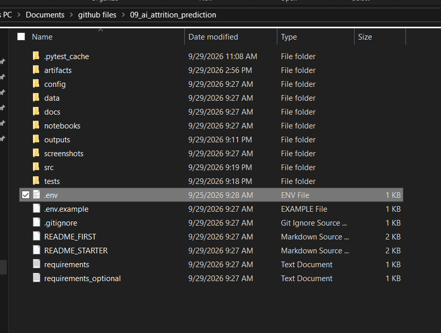
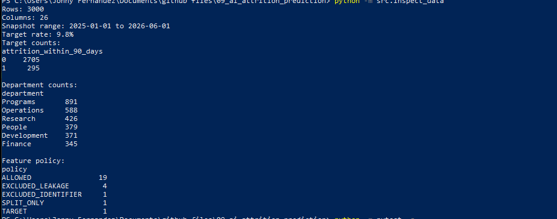
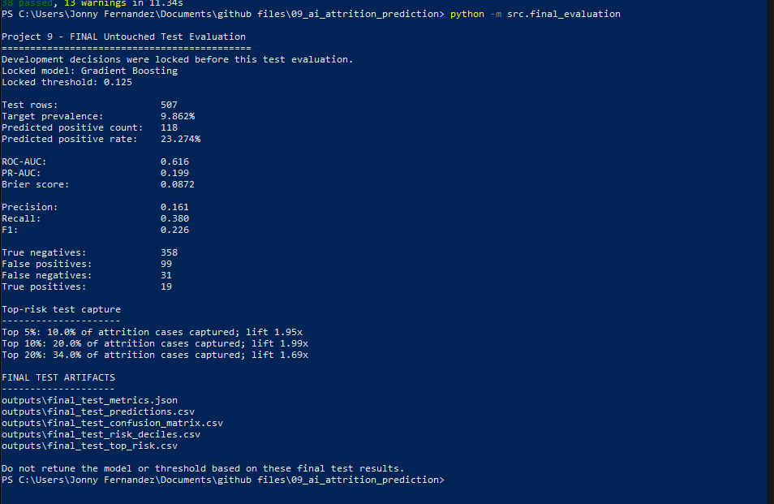
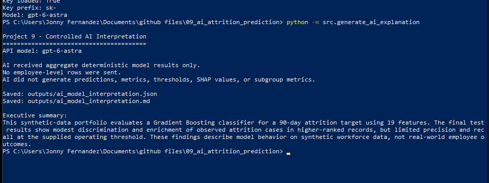
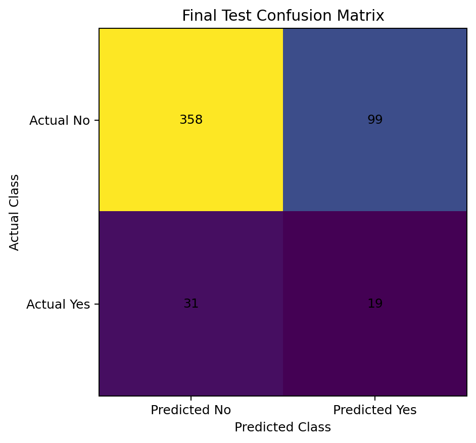
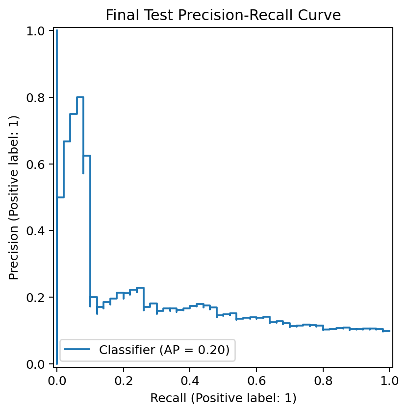
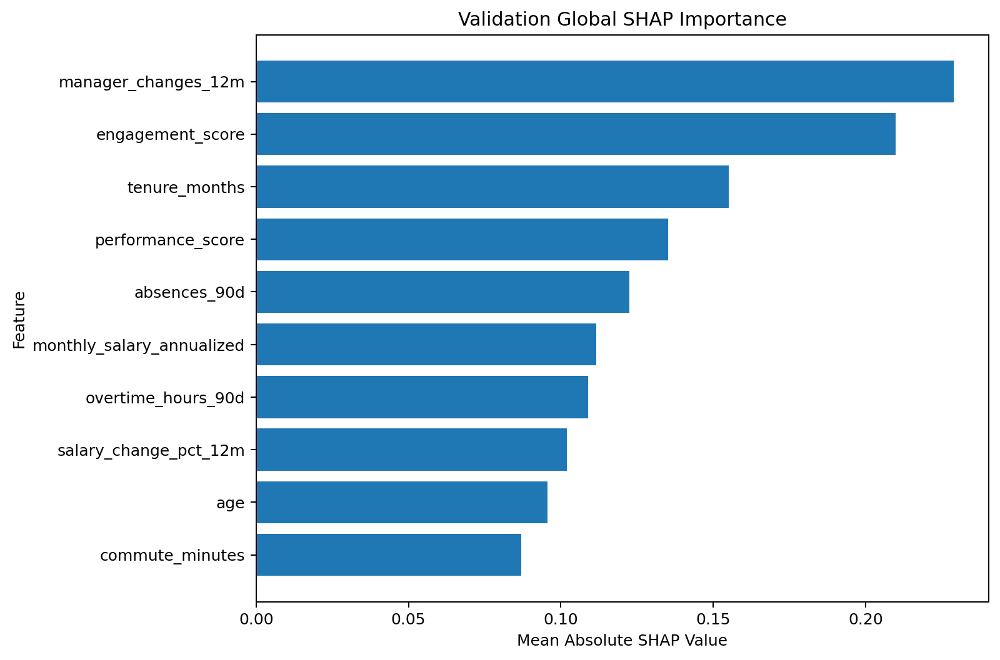
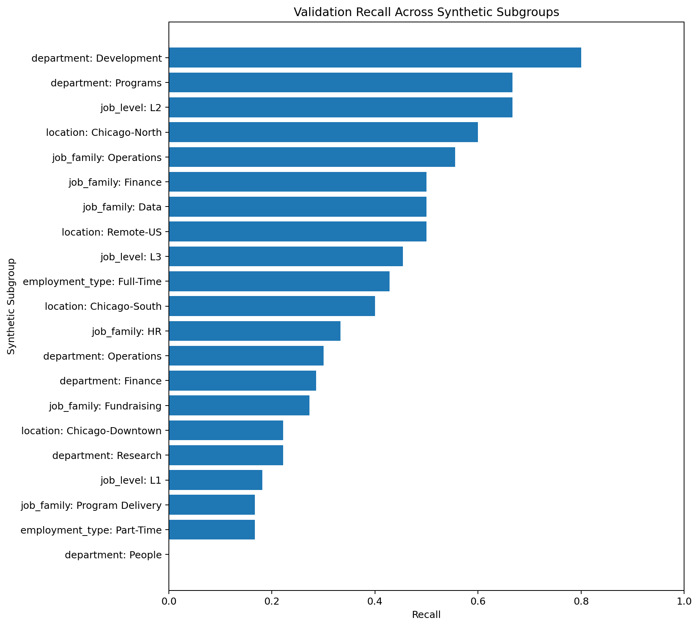

# AI-Enhanced Employee Attrition Prediction & Explainability System

An end-to-end machine-learning portfolio project that predicts whether a synthetic employee will leave within 90 days and combines predictive modeling, temporal validation, threshold analysis, explainability, subgroup diagnostics, model persistence, automated testing, and a controlled AI interpretation layer.

> **Important:** This project uses synthetic workforce data only. Model outputs are predictive diagnostics and are not intended for real employment decisions.

---

## Project Overview

This project demonstrates a production-style data science workflow for an imbalanced employee attrition problem.

The system includes:

- chronological train / validation / test splitting
- leakage-aware feature controls
- logistic regression baseline
- Random Forest comparison
- Gradient Boosting modeling
- ROC-AUC and PR-AUC evaluation
- Brier score and calibration diagnostics
- deterministic threshold analysis
- confusion matrix and error analysis
- lift and cumulative gains
- permutation feature importance
- SHAP global and local explainability
- subgroup performance diagnostics
- serialized model artifacts and metadata
- deterministic model reporting
- controlled OpenAI interpretation of verified analytical outputs
- automated pytest coverage

The machine-learning pipeline—not an LLM—produces all probabilities, predictions, metrics, thresholds, feature importance values, and SHAP explanations.

---

## Final Model

| Item | Result |
|---|---|
| Model | Gradient Boosting |
| Estimator | `GradientBoostingClassifier` |
| Prediction target | Attrition within 90 days |
| Features | 19 |
| Operating threshold | 0.125 |
| Threshold selection | Maximum validation F1 |
| Calibration | None |
| Hyperparameter tuning | None |
| Class weighting | None |
| Final test used for model selection | No |
| Data | Synthetic only |

The model and threshold were locked before the final test period was evaluated.

---

## Chronological Modeling Design

| Split | Period | Rows | Purpose |
|---|---|---:|---|
| Train | Jan 2025 – Dec 2025 | 1,997 | Fit preprocessing and models |
| Validation | Jan 2026 – Mar 2026 | 496 | Model comparison and threshold development |
| Final Test | Apr 2026 – Jun 2026 | 507 | Untouched temporal holdout |

The final test period was not used to choose the model or threshold.

---

## Final Untouched Test Results

| Metric | Result |
|---|---:|
| Test rows | 507 |
| Target prevalence | 9.862% |
| ROC-AUC | 0.616 |
| PR-AUC | 0.199 |
| Brier score | 0.0872 |
| Precision | 0.161 |
| Recall | 0.380 |
| F1 | 0.226 |
| Predicted-positive rate | 23.274% |

### Final Test Confusion Matrix

| | Predicted No Attrition | Predicted Attrition |
|---|---:|---:|
| Actual No Attrition | 358 | 99 |
| Actual Attrition | 31 | 19 |

The holdout results are reported as observed rather than tuning the model after seeing them.

---

## Ranking Performance

The model retained ranking signal on the final temporal holdout.

| Risk Group | Attrition Captured | Lift |
|---|---:|---:|
| Top 5% | 10.0% | 1.95x |
| Top 10% | 20.0% | 1.99x |
| Top 20% | 34.0% | 1.69x |

Higher-scored groups contained observed attrition cases at a higher rate than the overall final-test population.

---

## Model Development Results

### Naive and Logistic Baselines

The initial unweighted logistic regression improved substantially over a naive prevalence model:

| Model | Validation ROC-AUC | Validation PR-AUC |
|---|---:|---:|
| Naive prevalence | 0.500 | 0.097 |
| Logistic regression | 0.674 | 0.171 |

At a default threshold of `0.50`, the logistic model predicted no positive cases.

This demonstrated why an arbitrary `0.50` threshold was inappropriate for this imbalanced classification problem.

### Candidate Model Comparison

| Model | Validation ROC-AUC | Validation PR-AUC | Brier |
|---|---:|---:|---:|
| Logistic Regression | 0.674 | 0.171 | 0.085 |
| Random Forest | 0.651 | 0.175 | 0.085 |
| Gradient Boosting | 0.659 | 0.195 | 0.085 |

Gradient Boosting was retained as the development candidate because it provided the strongest validation PR-AUC and the highest validation F1 at its selected threshold.

---

## Threshold Analysis

The operating threshold was selected using validation data only.

### Logistic Regression

- selected threshold: `0.100`
- validation F1: `0.253`
- precision: `0.159`
- recall: `0.625`
- flagged population: `38.1%`
- attrition cases captured: `62.5%`

### Gradient Boosting

- selected threshold: `0.125`
- validation F1: `0.277`
- precision: `0.213`
- recall: `0.396`
- flagged population: `17.9%`
- attrition cases captured: `39.6%`

The Gradient Boosting threshold was selected using a deterministic maximum-F1 rule.

This is a statistical portfolio-development rule, not a recommended real-world HR operating policy.

---

## Calibration Diagnostics

Calibration was evaluated before deciding whether a separate calibration layer was necessary.

| Metric | Logistic Regression | Gradient Boosting |
|---|---:|---:|
| Validation prevalence | 9.677% | 9.677% |
| Average predicted probability | 9.928% | 8.998% |
| Brier score | 0.0853 | 0.0847 |
| Weighted absolute calibration error | 3.165% | 3.109% |

The diagnostics did not provide enough evidence to justify adding a separate probability-calibration layer during development.

---

## Validation Lift and Gains

Gradient Boosting concentrated a meaningful share of validation attrition cases in higher-ranked risk groups.

| Risk Group | Population | Attrition Captured | Observed Attrition | Lift |
|---|---:|---:|---:|---:|
| Top 5% | 5.0% | 12.5% | 24.0% | 2.48x |
| Top 10% | 10.1% | 22.9% | 22.0% | 2.27x |
| Top 20% | 20.2% | 43.8% | 21.0% | 2.17x |

The top 20% of validation records contained approximately 44% of observed attrition cases.

---

## Explainability

### Permutation Importance

Validation permutation importance was measured using PR-AUC / average precision.

Leading features included:

1. `manager_changes_12m`
2. `tenure_months`
3. `salary_change_pct_12m`
4. `commute_minutes`
5. `engagement_score`
6. `absences_90d`
7. `overtime_hours_90d`
8. `age`

Permutation importance measures predictive dependence. It does not establish causation.

### SHAP

Tree SHAP explanations were generated for the Gradient Boosting model.

The implementation:

- calculates SHAP values for the fitted tree model
- aggregates one-hot encoded values back to the original workforce features
- produces global feature importance
- produces local explanations for selected synthetic records
- distinguishes upward versus downward model-score contributions
- stores row-level and summary explainability artifacts separately

SHAP values describe how the fitted model generated a score. They should not be interpreted as evidence that a feature causes attrition.

---

## Error Analysis

At the selected validation threshold of `0.125`:

| Classification | Count |
|---|---:|
| True Positive | 19 |
| True Negative | 378 |
| False Positive | 70 |
| False Negative | 29 |

The analysis identified both:

- threshold-boundary errors
- high-confidence false positives
- high-confidence false negatives

This demonstrates that changing the operating threshold alone would not eliminate all model mistakes.

---

## Subgroup Diagnostics

Model performance was examined across synthetic:

- department
- job family
- job level
- location
- employment type

Metrics included:

- subgroup prevalence
- average predicted probability
- predicted-positive rate
- ROC-AUC
- PR-AUC
- Brier score
- precision
- recall
- false-positive rate
- false-negative rate

Only groups meeting the configured minimum sample size of 50 records were reported.

The results showed meaningful variation across some synthetic groups.

These results are model-performance diagnostics only and do not establish that the model is fair or unfair.

---

## Controlled AI Interpretation

OpenAI is used only after the deterministic predictive calculations are complete.

The AI layer receives aggregate, verified outputs such as:

- final model metrics
- ranking and lift results
- permutation importance
- SHAP summary statistics
- subgroup diagnostics

It does **not** receive employee-level rows.

The AI layer is explicitly prohibited from:

- generating predictions
- changing probabilities
- changing thresholds
- calculating new model metrics
- changing SHAP values
- changing subgroup metrics
- describing predictive associations as causal
- recommending hiring, firing, discipline, promotion, compensation, or other employment actions

Generated AI artifacts are stored separately from deterministic model outputs.

---

## Portfolio Visualizations

Generated charts are available in:

```text
outputs/charts/
```

The chart package includes:

- target distribution
- chronological train / validation / test design
- final test ROC curve
- final test precision-recall curve
- final test confusion matrix
- final test risk deciles
- validation threshold tradeoff
- validation calibration diagnostic
- cumulative lift
- cumulative gains
- permutation feature importance
- SHAP importance
- subgroup recall
- subgroup false-positive rate

---

## Screenshots

### Project Structure

The completed repository separates source code, configuration, synthetic data, tests, model artifacts, analytical outputs, documentation, and screenshots.



### Synthetic Data Inspection

Initial inspection validates the 3,000-row synthetic workforce dataset, target prevalence, department distribution, and feature-policy classifications.



### Final Untouched Test Evaluation

The final temporal holdout was evaluated only after the model and threshold were locked. The Gradient Boosting model achieved a final ROC-AUC of `0.616`, PR-AUC of `0.199`, and F1 of `0.226` at the locked `0.125` threshold.



### Controlled AI Interpretation

The optional OpenAI layer receives aggregate deterministic analytical results only. Employee-level rows are not sent to the model, and the AI does not generate predictions, metrics, thresholds, SHAP values, or subgroup calculations.



### Final Test Confusion Matrix

The locked final-test threshold produced 358 true negatives, 99 false positives, 31 false negatives, and 19 true positives.



### Final Test Precision-Recall Curve

Precision-recall analysis is especially useful for this imbalanced attrition target, where approximately 10% of records are positive.



### SHAP Explainability

Global SHAP analysis summarizes which original workforce features had the largest contribution magnitudes in the fitted Gradient Boosting model.



### Synthetic Subgroup Diagnostics

The project compares model recall across eligible synthetic workforce subgroups while avoiding blanket claims about model fairness.



---

## Project Structure

```text
09_ai_attrition_prediction/
│
├── artifacts/
│   ├── development_model_lock.json
│   ├── final_model_pipeline.joblib
│   └── model_metadata.json
│
├── config/
│   └── project_config.json
│
├── data/
│   ├── raw/
│   │   └── employee_attrition_snapshots_synthetic.csv
│   └── reference/
│       ├── data_dictionary.csv
│       └── feature_policy.csv
│
├── docs/
│
├── notebooks/
│
├── outputs/
│   ├── charts/
│   ├── ai_model_interpretation.json
│   ├── ai_model_interpretation.md
│   ├── final_test_confusion_matrix.csv
│   ├── final_test_metrics.json
│   ├── final_test_risk_deciles.csv
│   ├── final_test_top_risk.csv
│   ├── model_report.md
│   ├── validation_permutation_importance.csv
│   ├── validation_risk_deciles.csv
│   ├── validation_shap_summary.csv
│   └── validation_subgroup_metrics.csv
│
├── screenshots/
│   ├── 01_project_structure.png
│   ├── 02_data_inspection.png
│   ├── 03_final_test_results.png
│   ├── 04_ai_interpretation.png
│   ├── 05_final_test_confusion_matrix.png
│   ├── 06_final_test_pr_curve.png
│   ├── 07_shap_importance.png
│   └── 08_subgroup_diagnostics.png
│
├── src/
│   ├── ai_explanation.py
│   ├── baseline.py
│   ├── calibration.py
│   ├── calibration_analysis.py
│   ├── data_contract.py
│   ├── error_analysis.py
│   ├── error_analysis_report.py
│   ├── evaluation.py
│   ├── feature_importance.py
│   ├── feature_importance_report.py
│   ├── final_evaluation.py
│   ├── generate_ai_explanation.py
│   ├── generate_model_report.py
│   ├── inspect_data.py
│   ├── model_comparison.py
│   ├── model_persistence.py
│   ├── model_report.py
│   ├── persist_final_model.py
│   ├── portfolio_charts.py
│   ├── portfolio_diagnostic_charts.py
│   ├── risk_analysis.py
│   ├── risk_analysis_report.py
│   ├── shap_explainability.py
│   ├── shap_report.py
│   ├── subgroup_analysis.py
│   ├── subgroup_analysis_report.py
│   ├── threshold_analysis.py
│   ├── threshold_selection.py
│   └── thresholds.py
│
├── tests/
│   ├── test_ai_explanation.py
│   ├── test_calibration.py
│   ├── test_data_contract.py
│   ├── test_error_analysis.py
│   ├── test_evaluation.py
│   ├── test_feature_importance.py
│   ├── test_model_persistence.py
│   ├── test_model_report.py
│   ├── test_risk_analysis.py
│   ├── test_shap_explainability.py
│   ├── test_subgroup_analysis.py
│   └── test_thresholds.py
│
├── .env.example
├── .gitignore
├── README.md
├── README_FIRST.md
├── README_STARTER.md
├── requirements.txt
└── requirements_optional.txt
```

---

## Installation

Clone the repository:

```powershell
git clone https://github.com/jonny-fernandez/09_ai_attrition_prediction.git
cd 09_ai_attrition_prediction
```

Install the core dependencies:

```powershell
python -m pip install -r requirements.txt
```

Install optional explainability and AI dependencies:

```powershell
python -m pip install -r requirements_optional.txt
```

The project was developed using Python 3.10.

---

## Environment Variables

The predictive machine-learning system does not require an OpenAI API key.

The API key is required only for the optional AI interpretation layer.

Use `.env.example` as a reference and create your own local `.env` file:

```text
OPENAI_API_KEY=your_api_key
OPENAI_MODEL=gpt-6-astra
```

The real `.env` file is excluded by `.gitignore` and should never be committed.

---

## Running the Project

### Inspect the synthetic dataset

```powershell
python -m src.inspect_data
```

### Run the automated test suite

```powershell
python -m pytest -q
```

### Evaluate the baseline model

```powershell
python -m src.baseline
```

### Compare candidate models

```powershell
python -m src.model_comparison
```

### Run calibration diagnostics

```powershell
python -m src.calibration_analysis
```

### Inspect threshold tradeoffs

```powershell
python -m src.threshold_analysis
```

### Reproduce threshold selection

```powershell
python -m src.threshold_selection
```

### Run validation error analysis

```powershell
python -m src.error_analysis_report
```

### Run validation lift / gains analysis

```powershell
python -m src.risk_analysis_report
```

### Run subgroup diagnostics

```powershell
python -m src.subgroup_analysis_report
```

### Generate permutation importance

```powershell
python -m src.feature_importance_report
```

### Generate SHAP explanations

```powershell
python -m src.shap_report
```

### Generate deterministic model report

```powershell
python -m src.generate_model_report
```

### Generate controlled AI interpretation

```powershell
python -m src.generate_ai_explanation
```

### Generate portfolio charts

```powershell
python -m src.portfolio_charts
python -m src.portfolio_diagnostic_charts
```

---

## Automated Testing

The finished project includes **49 automated tests** covering areas such as:

- data contracts
- binary-classification metrics
- calibration diagnostics
- threshold analysis
- deterministic threshold selection
- error analysis
- risk / lift analysis
- subgroup diagnostics
- permutation importance
- SHAP aggregation helpers
- model persistence
- deterministic report generation
- AI input/output boundaries

Run:

```powershell
python -m pytest -q
```

Expected result:

```text
49 passed
```

---

## Reproducibility

The exact final-evaluation pipeline is serialized to:

```text
artifacts/final_model_pipeline.joblib
```

Model metadata is stored in:

```text
artifacts/model_metadata.json
```

The development decision was locked before final-test evaluation in:

```text
artifacts/development_model_lock.json
```

The saved model artifact includes a SHA-256 checksum so the serialized pipeline can be verified against the reported results.

The reported final model was trained only on the original training period. Validation and final test records were not added back into the persisted model's fitting dataset.

---

## Security and Data Handling

- `.env` is excluded from Git.
- API credentials are not committed to the repository.
- `.env.example` contains only placeholder configuration.
- The OpenAI explanation layer receives aggregate analytical outputs only.
- Employee-level rows are not sent to OpenAI.
- The repository uses synthetic workforce data only.
- The language model does not generate or modify predictive outputs.

---

## Limitations

- All workforce records are synthetic.
- Predictive associations do not establish causality.
- Some synthetic feature relationships are simplified and may not represent real HR systems.
- The selected threshold is based on validation F1 rather than organizational costs or intervention capacity.
- Final temporal holdout performance was lower than validation on some metrics.
- Subgroup metrics vary across synthetic groups.
- Model outputs should not be used for adverse employment decisions.
- SHAP and feature-importance values explain model behavior rather than causal effects.
- AI-generated text is explanatory only and is separated from deterministic predictive calculations.

---

## Technologies

- Python
- pandas
- NumPy
- scikit-learn
- Matplotlib
- SHAP
- pytest
- joblib
- OpenAI Responses API
- Structured Outputs
- python-dotenv
- Git
- GitHub

---

## Why This Project Matters

This project demonstrates more than fitting a classifier.

It separates:

1. **prediction**
2. **evaluation**
3. **threshold decisions**
4. **explainability**
5. **subgroup diagnostics**
6. **reproducibility**
7. **AI-generated interpretation**

That separation makes the system easier to audit and demonstrates how generative AI can be added to a traditional data-science workflow without allowing the language model to control or invent the underlying analytical results.

---

## Repository

GitHub:

```text
https://github.com/jonny-fernandez/09_ai_attrition_prediction
```